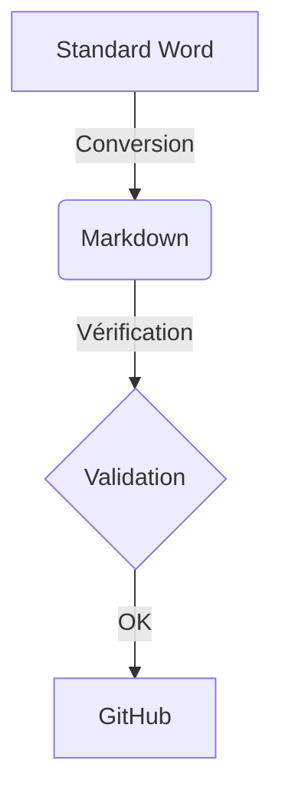
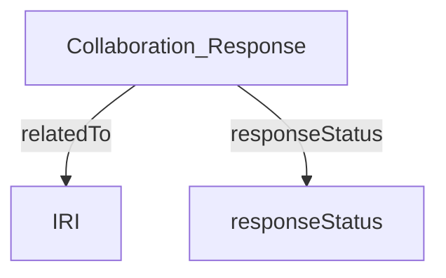

# AX-001: Cereals and pulses — Specification and test methods

## FOREWORD
>This section is non-normative

ISO (the International Organization for Standardization) is a worldwide federation of national standards bodies (ISO member bodies). The work of preparing International Standards is normally carried out through ISO technical committees. Each member body interested in a subject for which a technical committee has been established has the right to be represented on that committee. International organizations, governmental and non-governmental, in liaison with ISO, also take part in the work. ISO collaborates closely with the International Electrotechnical Commission (IEC) on all matters of electrotechnical standardization. 

## 1. TEST SNIPPET

--8<-- "Glossary.md:def_api"

--8<-- "Glossary.md:def_v2x"

## 1. TEST MERMAID

[Table 1: Maximum permissible mass fraction of defects]

